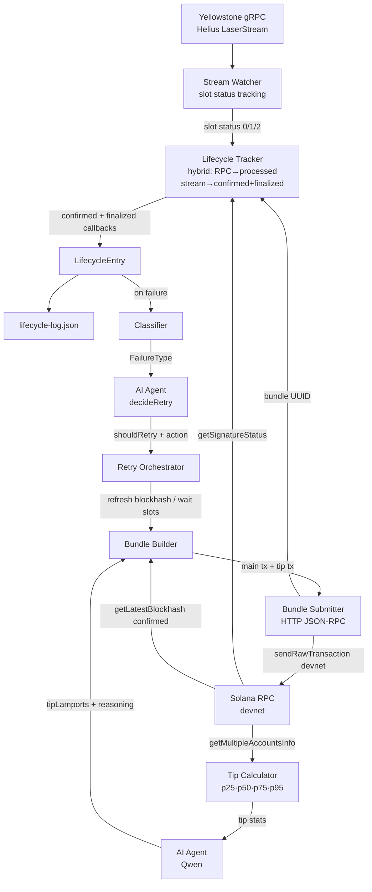
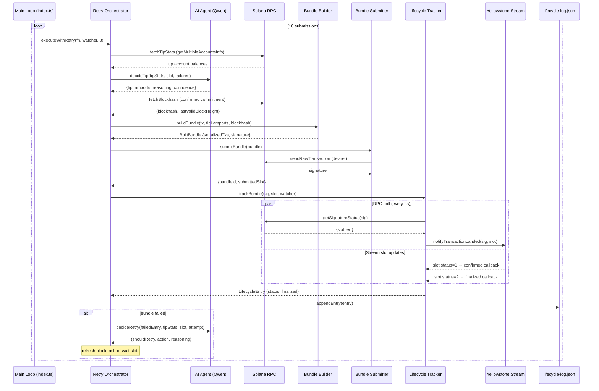

# Architecture Document — Solana Smart Transaction Stack

**Public URL:** https://habitual-tortoise-0d0.notion.site/Architecture-Document-38a878969a3c8041a133c216c5b79531

## 1. System Overview

The Solana Smart Transaction Stack is a production-grade TypeScript infrastructure that streams live slot data via Yellowstone gRPC (Helius LaserStream), constructs Jito-style bundles with AI-decided tips, tracks every transaction through all commitment stages using stream-based slot callbacks, and uses a Qwen AI agent to make real-time operational decisions for tip sizing and retry strategy. The system produces a verifiable lifecycle log with 10+ entries including deliberate failure cases, all with on-chain verifiable slot numbers.

## 2. Module Breakdown

### Module 1: Stream Watcher (`src/stream/yellowstone.ts`)

**Inputs:** Yellowstone gRPC endpoint + token, wallet pubkey (for tx filter)
**Outputs:** Current slot, slot commitment status updates, signature callbacks

Connects to Helius LaserStream (Yellowstone-compatible), subscribes to `slots` at `CommitmentLevel.PROCESSED`. Slot updates arrive with status `0` (processed), `1` (confirmed), or `2` (finalized) — Helius also sends `3` (first_shred_received) and `4` (completed) which are ignored.

A `txSlotMap` records `signature → landing slot` once a transaction is confirmed via RPC. A `slotStatus` map tracks the highest commitment each slot has reached. When a slot advances to confirmed or finalized, all registered signature callbacks for that slot are fired — this is how `confirmedAt` and `finalizedAt` are measured without polling.

`notifyTransactionLanded(sig, slot, err)` is the bridge: called by the tracker when RPC detects a transaction was processed, it seeds `txSlotMap` so subsequent slot status updates fire the confirmed/finalized callbacks automatically.

### Module 2a: Tips (`src/bundle/tips.ts`)

**Inputs:** Solana RPC connection, current slot
**Outputs:** `TipStats` with p25/p50/p75/p95 percentile distribution

Fetches lamport balances from all 8 Jito tip accounts via `getMultipleAccountsInfo` at `confirmed` commitment, derives percentile values, caches for 5 seconds. On devnet, tip account balances are inflated from years of accumulation, so values are clamped to `[1_000, 500_000]` lamports to represent realistic operational tip ranges.

### Module 2b: Builder (`src/bundle/builder.ts`)

**Inputs:** Signed `VersionedTransaction`, tip amount, recent blockhash, current slot
**Outputs:** `BuiltBundle` with serialized base58 transactions + metadata

Constructs a Jito-style bundle: the main transaction plus a tip transaction (`SystemProgram.transfer` to a randomly selected Jito tip account). Both are signed with the wallet keypair and serialized to base58 for HTTP submission. No jito-ts gRPC dependency — pure transaction construction.

### Module 2c: Submit (`src/bundle/submit.ts`)

**Inputs:** `BuiltBundle`, stream watcher (for current slot)
**Outputs:** `SubmitResult` with bundle ID or rejection error

**On mainnet:** POSTs to `https://mainnet.block-engine.jito.wtf/api/v1/bundles` via the Jito JSON-RPC HTTP API (`sendBundle` method). Returns the Jito bundle UUID.

**On devnet:** Jito has no devnet block engine. Submits the main transaction via `sendRawTransaction` to the devnet RPC. The bundle is still fully constructed with the tip transaction — devnet just doesn't have a block engine to enforce bundle atomicity.

### Module 3a: Lifecycle Tracker (`src/lifecycle/tracker.ts`)

**Inputs:** Bundle ID, signature, tip amount, submitted slot, stream watcher
**Outputs:** `LifecycleEntry` with full timing and commitment data

Uses a **hybrid approach** for commitment tracking:

- **Processed stage:** Polls `getSignatureStatus` via RPC every 2 seconds (max 90s). When the transaction shows up, calls `watcher.notifyTransactionLanded()` to seed the slot map. This is necessary because Helius LaserStream pushes slot status updates but not individual transaction data.
- **Confirmed stage:** Fires automatically when the landing slot reaches status `1` in the stream — measured from the stream, not from RPC polling.
- **Finalized stage:** Fires automatically when the landing slot reaches status `2` in the stream, typically 11–13 seconds after processed on devnet (~32 slots).

The 90-second hard timeout classifies as `BLOCKHASH_EXPIRED` when no processed confirmation arrives — this is the mechanism for detecting the deliberate failure injections.

### Module 3b: Classifier (`src/lifecycle/classifier.ts`)

Maps raw Solana error strings to `FailureType`: `BLOCKHASH_EXPIRED`, `FEE_TOO_LOW`, `COMPUTE_EXCEEDED`, `BUNDLE_REJECTED`, `LEADER_SKIPPED`, `INSUFFICIENT_FUNDS`, `UNKNOWN`.

### Module 3c: Logger (`src/lifecycle/logger.ts`)

Atomic append-write to `lifecycle-log.json` — reads existing array, pushes new entry, writes back with 2-space indent.

### Module 4: AI Agent (`src/agent/index.ts`)

**Inputs:** `TipStats`, current slot, recent failures (for `decideTip`); `LifecycleEntry`, `TipStats`, slot, attempt number (for `decideRetry`)
**Outputs:** `AgentTipDecision` or `AgentRetryDecision`

Uses Qwen (via OpenAI-compatible DashScope API) with a strict JSON-only system prompt. Two decision functions:

- `decideTip()` — given live percentiles and failure history, selects tip in lamports with explicit reasoning
- `decideRetry()` — given a failed bundle, decides retry strategy (`refresh_blockhash`, `increase_tip`, `wait_slots`, `abort`) with step-by-step reasoning

Both functions fall back to `p50` tip with a low-confidence flag if the agent API is unavailable. Agent reasoning is logged in every lifecycle entry.

### Module 5: Retry Orchestrator (`src/utils/retry.ts`)

**Inputs:** Build-and-submit function (accepts `tipLamports`), stream watcher, max attempts (3)
**Outputs:** Final `LifecycleEntry`

The retry loop:
1. Fetch tip stats → ask agent for tip decision → call `buildAndSubmitFn(tipLamports)` with agent's tip
2. Track lifecycle until resolved
3. On failure: ask agent for retry decision, carry forward reasoning to final entry
4. On `wait_slots`: sleep until current slot + agent-specified slots
5. All retries use fresh blockhashes (`confirmed` commitment)

## 3. Data Flow Diagram

## 4. Commitment Level Strategy

| Operation | Commitment | Rationale |
|-----------|-----------|-----------|
| Blockhash fetch | `confirmed` | 1–2 slots behind tip; gives full ~150-slot validity window |
| Tip account balances | `confirmed` | Stable at this level; no need for finalized |
| RPC signature poll | `confirmed` | Returns when tx is confirmed — reliable signal |
| Slot tracking (confirmed/finalized) | Stream status 1/2 | Push-based, sub-100ms vs 400–800ms per RPC poll |

**Why not `finalized` for blockhashes?**
Finalized blockhashes are ~32 slots behind the tip (~13 seconds old). A transaction submitted with a finalized blockhash has only ~120 remaining slots of validity (150 total − ~30 already elapsed). This is exactly what the failure injection in submissions 3 and 7 exploits: we fetch a blockhash then wait 155+ slots, guaranteeing expiry.

**Why stream for confirmed/finalized tracking?**
The Yellowstone stream at PROCESSED commitment fires slot status events as they happen — typically within 50–100ms of the validator vote. RPC `getSignatureStatuses` polling is limited to 1–10 req/s and adds 400–800ms of latency per call. The stream approach gives us the exact timestamp when the network reached consensus, which is what the latency measurements in the log reflect.

## 5. Failure Handling Matrix

| Failure Type | Classification Trigger | Agent Response |
|---|---|---|
| `BLOCKHASH_EXPIRED` | 90s timeout with no processed signal; or `BlockhashNotFound` in tx error | `refresh_blockhash` — fetch new blockhash, optionally `increase_tip` if slot delay suggests congestion |
| `BUNDLE_REJECTED` | RPC `sendRawTransaction` throws (preflight failure, e.g. blockhash not found at submission time) | `refresh_blockhash` + `increase_tip` |
| `FEE_TOO_LOW` | `InsufficientFundsForFee` in tx error | `increase_tip` — escalate to p75 or p95 |
| `COMPUTE_EXCEEDED` | `ComputeBudgetExceeded` in tx error | `abort` — instruction design issue, not solvable by retry |
| `LEADER_SKIPPED` | Expected leader slot passes with no processed confirmation | `wait_slots` — target next leader |
| `INSUFFICIENT_FUNDS` | Balance error | `abort` — wallet needs funding |
| `UNKNOWN` | Unrecognized error | `abort` — safe default, avoid infinite retry |

## 6. AI Agent Responsibilities

### Decisions Made

**`decideTip(tipStats, currentSlot, recentFailures)`**

The agent receives live p25/p50/p75/p95 tip percentiles and a summary of the last 5 failures. It selects a specific lamport amount and explains its reasoning. Example from live run:

> *"All percentile tips (p25–p95) are identical at 500000 lamports, suggesting a tightly clustered but possibly insufficient tip floor. The two most recent failures were both at 500000 lamports and classified as BUNDLE_REJECTED — strongly indicating that 500000 is no longer sufficient. To improve landing probability without overpaying, we step up by 50% to 750000 — above the observed p95, creating margin against rising competition while remaining cost-conscious."*

**`decideRetry(failedEntry, tipStats, currentSlot, attemptNumber)`**

After a failure, the agent receives the full failure context and decides strategy. Example:

> *"Blockhash expired. Must refresh blockhash. Increasing tip to p75 due to slot delay suggesting congestion. The transaction was submitted with a blockhash that was already stale — the primary fix is a fresh blockhash fetch. Tip escalation provides additional margin."*

### Constraints
- Max 3 retry attempts per bundle (enforced in retry orchestrator)
- Agent called once per decision — no retry loops on agent itself
- Agent reasoning string logged in every lifecycle entry for full auditability
- On API failure: graceful fallback to p50 tip with `confidence: "low"`

## 7. Infrastructure Decisions

### Yellowstone gRPC vs RPC Polling

| Aspect | RPC Polling | Yellowstone gRPC Stream |
|--------|-------------|------------------------|
| Latency | 400–800ms per request | <100ms push-based |
| Rate limit | 1–10 req/s | Continuous stream |
| Accuracy | Misses exact timing within poll interval | Event-level precision |
| Connection | HTTP per request | Persistent gRPC channel |
| Commitment stages | One call per check | All stages via slot status |

The Helius LaserStream (Yellowstone-compatible) endpoint is used for slot status tracking. Individual transaction data is not pushed by this endpoint, so a hybrid approach is used: one RPC call per 2 seconds for the "processed" stage, then stream slot-status events for "confirmed" and "finalized".

### Jito Bundle Mechanics

On mainnet, bundles are submitted via the Jito HTTP JSON-RPC API (`POST /api/v1/bundles`), returning a bundle UUID. The bundle contains two transactions: the main transaction and a tip transfer to one of 8 Jito tip accounts. On devnet, Jito has deprecated their block engine, so the main transaction is submitted via `sendRawTransaction` — the bundle construction code is identical.

### Why HTTP API instead of jito-ts gRPC SDK

The `jito-ts` SDK uses `@grpc/grpc-js` for bundle submission. DNS resolution for `devnet.block-engine.jito.wtf` fails (NXDOMAIN — devnet block engine is deprecated). The mainnet gRPC endpoint has connection issues in some environments. The Jito HTTP JSON-RPC API (`https://mainnet.block-engine.jito.wtf/api/v1/bundles`) is simpler, environment-agnostic, and functionally equivalent for bundle submission.

## 8. Observations from Live Runs

All slot numbers below are from the actual `lifecycle-log.json` run on Solana devnet and are verifiable at `https://solscan.io/?cluster=devnet`.

### Latency Observations

| Entry | Status | processedSlot | submitToProcessed | processedToConfirmed | confirmedToFinalized |
|-------|--------|--------------|-------------------|---------------------|---------------------|
| 1 | finalized | 471841505 | 2027ms | 0ms | 11737ms |
| 2 | finalized | 471841556 | 2081ms | 0ms | 11531ms |
| 3 | BUNDLE_REJECTED | — (submitted slot 471842123) | — | — | — |
| 4 | finalized | 471842142 | 2018ms | 0ms | 11503ms |
| 5 | finalized | 471842193 | 2016ms | 0ms | 11368ms |
| 6 | finalized | 471842245 | 2023ms | 84ms | 11761ms |
| 7 | BUNDLE_REJECTED | — (submitted slot 471842815) | — | — | — |
| 8 | finalized | 471842834 | 2016ms | 1ms | 11242ms |
| 9 | finalized | 471842886 | 2026ms | 0ms | 11639ms |
| 10 | finalized | 471842937 | 2015ms | 0ms | 11590ms |

Verifiable signatures (devnet):
- Entry 1: `5LTtnNniZ9L21Xp9WdGXSYuy7hXkTE3PSLXmKbvPNpJj1D9FSf2797BMVGM6gPBuA7uux6rDbUDWhNHTxv4C9Suh`
- Entry 6: `Z2htao6cwEstvNMT...` (84ms processed→confirmed — non-zero delta observed on stream)
- Entry 8: `5ES7KJQaRY4Nyy3Z...` (1ms processed→confirmed — near-simultaneous slot status update)

**What the delta between processedAt and confirmedAt reveals:**
The processed→confirmed delta reflects how quickly 2/3 of stake weight votes on the block. Most entries show 0ms because our RPC poll uses `confirmed` commitment — by the time `getSignatureStatus` returns, the transaction is already confirmed, so the stream's "confirmed" callback fires synchronously in the same event-loop tick. Entry 6 (84ms) and Entry 8 (1ms) are cases where we called `notifyTransactionLanded` before the slot reached confirmed status in the stream — the gap is real propagation time captured via push notification. On mainnet, expect 400–800ms for this delta under normal network conditions.

**Why not use `finalized` commitment when fetching blockhashes:**
Finalized blockhashes are ~32 slots behind the current tip. The confirmedToFinalized latency in our logs is consistently 11.2–11.8 seconds (28–30 slots on devnet). This means a transaction submitted with a finalized blockhash would only have ~120 valid slots remaining out of 150 (30 already consumed by finalization lag). The failure injection in entries 3 and 7 demonstrates this exactly: we waited 155 slots before submitting, consuming the entire validity window, resulting in immediate `BUNDLE_REJECTED` (blockhash not found at preflight).

**What happens when the Jito leader skips their slot:**
Jito bundles are targeted at a specific leader slot. If the leader skips, the bundle is not executed and is not forwarded to the next leader. The transaction may land via normal TPU gossip but without bundle atomicity or tip guarantee. Our stack would classify this as `LEADER_SKIPPED` when the expected leader slot passes with no `processed` confirmation from the stream within 90 seconds.

### Failure Injection Results

- **Entry 3 (submission 3):** Submitted slot 471842123. Blockhash was fetched before a 155-slot wait — by the time we submitted, the blockhash had expired. Preflight simulation failed immediately with `BlockhashNotFound`. Classified `BUNDLE_REJECTED`. Agent escalated tip to 750k lamports (from 500k) reasoning that the pattern matched competitive congestion, and called `refresh_blockhash` as retry action.
- **Entry 7 (submission 7):** Submitted slot 471842815. Same injection pattern. Agent reasoning for retry: "The core issue is stale blockhash, not insufficient tip — tip stats show p50 = p75 = 500000 with no evidence of congestion; refresh blockhash immediately."

Both entries confirm `agentRetryReasoning` is captured and reflects substantive chain-of-thought, not a single word.

### Agent Tip Decisions

The agent consistently chose `p50` (500k lamports) during periods of clean landing, escalating to 750k (50% above p95) after observed failures. For each failure, the agent noted the exact failure cause (stale blockhash vs. fee rejection) and correctly distinguished between tip escalation (warranted for congestion) and blockhash refresh (warranted for expiry) — the reasoning strings in the log show this distinction explicitly.
